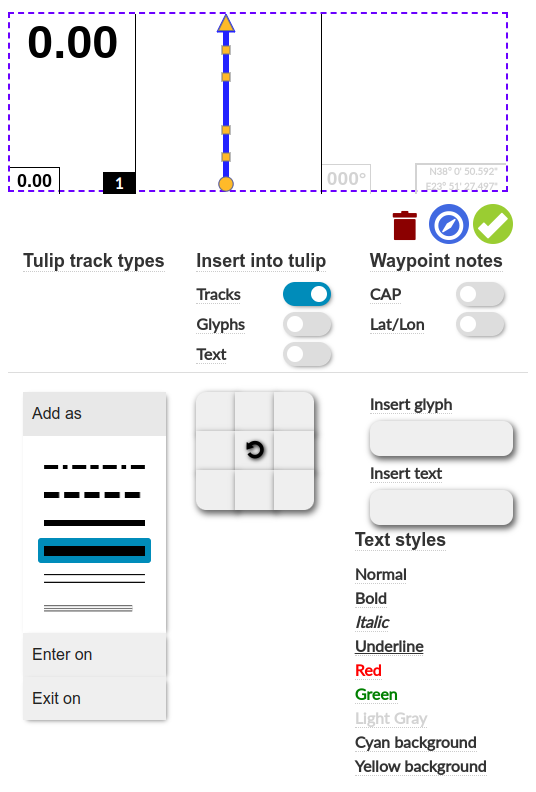

# Using Tulip

## Route planning and map controls
- **Click** on the map to add route points.
- **Double click** on a route point to add an instruction.
- **Double click** on an instruction route point to remove the instruction.
- **Right click** 2 times on a route point to delete it.
- To delete a range of points and any related instructions:  
    **Right click** on the first point to be deleted and then **right click** on the last point to be deleted

## Instruction editor
The Tulip Instruction Editor is a key component of the Tulip rally roadbook editor, designed to help you create and customize instructions with precision. This interface allows you to add tracks, glyphs, and waypoint notes, while providing tools to modify and visualize your rally route. Below is an overview of the editor's features based on the provided image.

Double click on roadbook instruction to begin editing.

### Action Icons

- Delete selected glyph from tulip
- Orient map with track
- Confirm (check mark) changes to instruction and exit edit mode.

### Insert Tulip items
- Tracks: Toggle to enable the insertion of track elements.
- Glyphs: Toggle to enable the insertion of glyphs.
- Text: Toggle to enable the insertion of text.

### Modify Selection
- A slider to adjust the properties of the selected note text, offering fine-tuned control over its appearance or position.
- Set text style

## Add/modify track

To add a Tulip track, first select your preferred track type from the list. Then, use the 3x3 grid of direction buttons to choose one of the 8 directional options (e.g., up, down, left, right, or diagonals) to set the track's orientation.

Tracks can be moved by selecting them and using the handles to shape and adjust their form.

To change track type, select a track and click on the new track type.

**Enter on**: Sets the entry track type for the current instruction. Additionally, it modifies the exit track type of the previous instruction to ensure a seamless transition.

**Exit on**: Sets the exit track type for the current instruction. It also modifies the enter track type of the next instruction to maintain route continuity.

**Delete tracks/glyphs** - Use the trash can icon or "Delete" to delete the selected track or glyph from Tulip. Note that entry and exit tracks cannot be deleted to maintain route integrity.

## Insert tulip glyphs
Toggle to enable or disable the insertion of glyphs (must be on to add glyphs). Once enabled, click on the 3x3 grid to set the glyph position. A popup with available glyphs will appear for selection. Holding the Shift key while clicking on a glyph allows for multiple insertions.
Show in sidebar

## Waypoint Notes
- To add a glyph, use the "Insert glyph" button to open the glyph selection popup, where you can choose from available glyphs. Holding the Shift key while clicking on a glyph allows for multiple insertions.
- To add text to notes use the Insert Text button.
- Click on text style to change the selected text item.
- To delete items from notes select item and press "Delete"
- CAP: Toggle to show or hide CAP headings in the notes.
- Lat/Lon: Toggle to show or hide latitude/longitude coordinates in the notes.

## Hepler tools
### Speed zones autofill

There is an option to populate all speed limit glyphs within a speed zone.
The first instruction in the zone must have a speed limit. Select the instruction and go to Edit -> Fill zone speed limit

If there are multiple speed limits within a zone these limits are respected for consecutive instructions. On the speed limit change instruction a previous speed limit end glyph is added.

Last instruction (FZ,FT,FN) is populated with speed limit end glyph

If 2 zones are one exactly after another, both zones will be filled as if it was a speed limit change.

### Street View
A google street view window is available under View -> Instruction street view

Click on an instruction to get streetview of that point